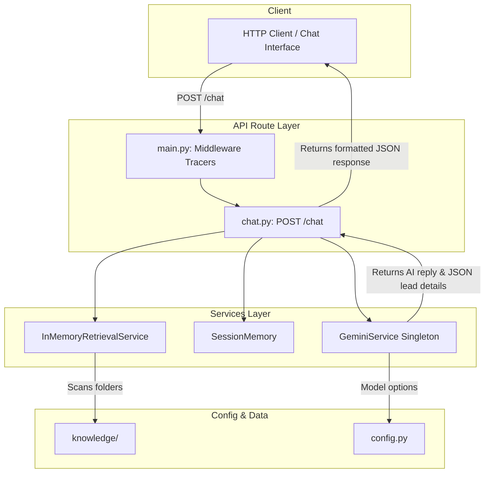

# Reusable Chatbot Backend Architecture - Phase 2

This document details the system design, code layout, and operational flows for the standalone AI Chatbot Backend.

---

## 1. System Design Blueprint

The backend is built as a branding-agnostic chatbot engine. All company details, pricing models, and service packages are loaded dynamically from `/knowledge` folders. This enables the codebase to power chatbots for schools, restaurants, hotels, gyms, or B2B businesses by swapping folders and configuration settings without refactoring.



---

## 2. Component Flows

### A. Dynamic Retrieval Flow
1. User submits a query to `/api/chat`.
2. The query is tokenized, stripped of punctuation, and cleaned of stopwords.
3. The engine scores matching documents using:
   - **Heading Overlap (h1/h2/h3)**: Match terms in document titles receive a high weight multiplier (6.0).
   - **Keyword Relevance**: Number of overlapping tokens between query and chunk (1.5).
   - **Content Similarity**: Checks direct Jaccard containment and phrase matches (5.0).
   - **File Priority**: Category weighting factors applied to files depending on subfolders (e.g. `faq/` is 1.6x, `policies/` is 0.5x).
4. Matches are sorted by score, and the top chunks are concatenated to build the system prompt context.

### B. Gemini Service Flow
- **Singleton**: The client configuration uses a thread-safe Singleton to prevent double initialization.
- **Retry Handling**: Includes retry loops using `tenacity` with exponential backoffs to recover from transient API timeouts or downtime.
- **Parallel Extraction**: Uses Gemini structured output schemas (`response_schema`) to evaluate conversational transcripts and extract name, phone, email, business name, requirements, budget, timeline, and confidence scores.

### C. Conversational Memory Flow
- Stores session details in a memory-only mapping container (`MemoryService`), indexed by `session_id`.
- Keeps track of user preferences, language settings, and dialogue stages so context remains preserved across conversational turns without databases.

---

## 3. Folder Explanation

- `/app/core/config.py`: Exposes model configurations, timeouts, and category priorities.
- `/app/services/memory.py`: In-memory session holder and preference merger.
- `/app/services/retrieval/`:
  - `base.py`: Swappable retrieval contract interface.
  - `memory.py`: Advanced multi-dimensional context assembler.
- `/app/services/ai/`:
  - `base.py`: Decoupled AI model interface.
  - `gemini.py`: Client SDK wrapper, token counter, and structured output parser.
- `/app/routes/chat.py`: REST endpoints for chat actions, health parameters, and uptime statistics.
- `/app/main.py`: Entry point exposing CORS settings, Swagger configurations, and request tracing middlewares.

---

## 4. API Documentation

### POST `/chat`
Submits a user message and returns structured assistant outputs.

**Request Schema:**
```json
{
  "message": "I need a website for my school brand. Budget is ₹25k.",
  "session_id": "sess-user-999"
}
```

**Response Schema:**
```json
{
  "success": true,
  "reply": "I'd love to help you build a premium school website...",
  "sources": [
    "services/websites.md",
    "pricing/packages.md"
  ],
  "lead_detected": true,
  "lead_details": {
    "name": null,
    "phone": null,
    "email": null,
    "business_name": null,
    "industry": "Education",
    "requirements": "Need school website",
    "budget": "₹25,000",
    "timeline": null,
    "confidence_score": 0.95
  },
  "response_time_ms": 1420,
  "model": "gemini-2.5-flash"
}
```

### GET `/health`
Checks backend component availability.
**Response:**
```json
{
  "status": "healthy",
  "components": {
    "server": "online",
    "gemini_connection": "configured",
    "gemini_api_status": "online",
    "knowledge_loader": "loaded",
    "retrieval_engine": "active"
  },
  "version": "0.2.0"
}
```

### GET `/status`
Exposes uptime metrics and indexes of loaded documents.
**Response:**
```json
{
  "server_uptime_seconds": 120.4,
  "gemini_model": "gemini-2.5-flash",
  "total_knowledge_files": 49,
  "loaded_categories": ["company", "pricing", "services"],
  "loaded_documents": ["company/profile.md", "pricing/packages.md"]
}
```

---

## 5. Environment Setup Guide

To run local instances:
1. Create a `.env` in the backend root directory.
2. Define the configuration variables:
   ```ini
   GEMINI_API_KEY=your_gemini_api_key
   GEMINI_MODEL=gemini-2.5-flash
   DEBUG=True
   HOST=127.0.0.1
   PORT=8000
   ```
3. Boot up the local server instance:
   ```bash
   python app/main.py
   ```
4. Access the auto-generated Swagger UI at `http://127.0.0.1:8000/docs`.
