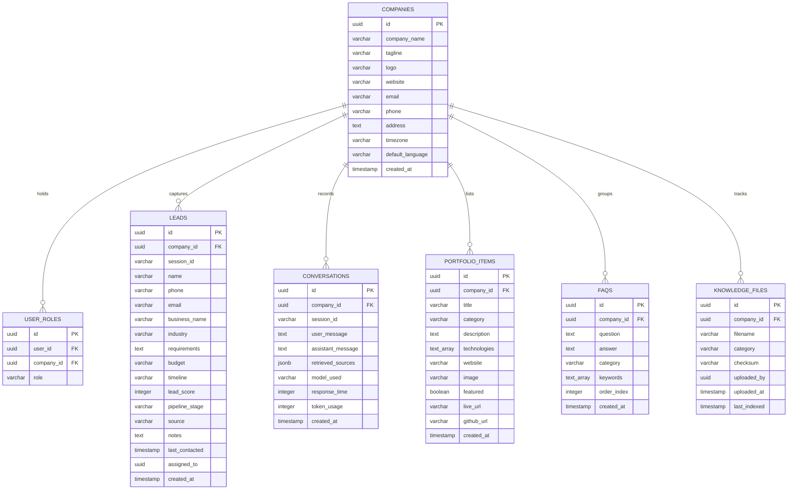

# SaaS Multi-Tenant Database & Auth Schema - Phase 3

This document explains the database structure, security policies, authentication flows, and SaaS white-label mechanics designed for ZenCro Digital.

---

## 1. Entity Relationship Diagram (ERD)

The database is built on a multi-tenant layout where every row maps back to a specific company ID.



---

## 2. Role-Based Access Control (RBAC)

We classify active admin user accounts into three security levels:
- **Owner**: Full access to update company settings, manage role assignments (`user_roles` table), and delete records (including leads).
- **Admin**: Can view and modify leads, conversations, FAQs, and portfolio projects. Cannot modify roles or delete leads.
- **Editor**: Limited access. Can update FAQs and portfolio projects. Cannot view leads or conversation transcripts.

### RLS Policies Mapping
| Table | Select Policy | Insert Policy | Update Policy | Delete Policy |
| :--- | :--- | :--- | :--- | :--- |
| **companies** | Public (`true`) | Disabled (System Seed) | Owner | Disabled |
| **user_roles** | Tenant Members | Owner | Owner | Owner |
| **leads** | Tenant Members | Public/Bot (`true`) | Owner, Admin | Owner |
| **conversations**| Public/Bot (`true`) | Public/Bot (`true`) | Disabled | Disabled |
| **portfolio_items**| Public (`true`) | Owner, Admin, Editor | Owner, Admin, Editor | Owner, Admin, Editor |
| **faqs** | Public (`true`) | Owner, Admin, Editor | Owner, Admin, Editor | Owner, Admin, Editor |
| **knowledge_files**| Owner, Admin, Editor | Owner, Admin, Editor | Owner, Admin, Editor | Owner, Admin, Editor |

---

## 3. JWT Authentication Lifecycles

```
[ Client ]                   [ FastAPI Middleware ]           [ Supabase Auth ]
    |                                  |                              |
    |---- Login (Email/Password) ----->|                              |
    |                                  |------ Verify credentials --->|
    |<--- Return Access/Refresh Token -|                              |
    |                                  |                              |
    |---- API Request with Bearer ----->|                              |
    |     Header (JWT)                 |                              |
    |                                  |------ Fetch User profile --->|
    |                                  |       and check role         |
    |                                  |<----- User & Role Verified --|
    |<--- Process request data --------|                              |
```

- **Login**: `/api/v1/auth/login` checks credentials against Supabase and returns the session tokens.
- **Logout**: `/api/v1/auth/logout` invalidates the token.
- **Refresh**: `/api/v1/auth/refresh` renews the access token before it expires.
- **Forgot Password**: `/api/v1/auth/forgot-password` sends a reset email link to the user.
- **Reset Password**: `/api/v1/auth/reset-password` accepts a recovery token and updates user credentials.

---

## 4. Reusable White-Label Mechanics

To deploy a chatbot for a new client company:
1. **Register Company**: Insert a company record into the `companies` table. This generates a unique `company_id`.
2. **Assign Administrator**: Add the client admin user to Supabase Auth, and insert their mapping role in `user_roles` with their assigned `company_id` and role (e.g. `'owner'`).
3. **Configure Search Knowledge**: Create a subfolder with their name under `/knowledge` or configure a database indexing pipeline linked to their `company_id`.
4. **Deploy Chat Widget**: Embed the web widget configured with the client's `company_id`. All chat turns, retrieval operations, and captured leads are automatically partitioned to that tenant ID, providing perfect security isolation.
